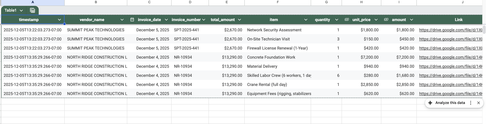

# Invoice Automation System (n8n + LLMs + Google Workspace)

This system automates the entire invoice intake → extraction → approval → reporting workflow using AI, manual data entry and fasten finance operations. It ingests emails automatically, extracts structured data from invoices using an LLM, routes high-value items for approval, and generates weekly financial summaries.

## Overview
An automated invoice-processing pipeline using n8n, OpenAI, Gmail, Google Sheets, and Slack.
The system ingests invoices from email, extracts invoice data using an LLM, detects duplicates, routes$$ high-value invoices for approval, stores every line item in a structured database, and generates weekly summaries.

## Before and After

### Before: Manual Invoice Processing
- **Time-consuming**: Finance team manually opens each email, downloads PDFs, and enters data into spreadsheets
- **Error-prone**: Manual data entry leads to typos, missing line items, and inconsistent formatting
- **Slow approval process**: High-value invoices require manual routing and tracking
- **Limited visibility**: No centralized view of all invoices and line items
- **Reactive reporting**: Weekly summaries require manual compilation and analysis

### After: Automated Invoice Processing
- **Instant processing**: Invoices are automatically extracted from emails and processed within minutes
- **Accurate extraction**: AI extracts all invoice data including vendor, dates, amounts, and detailed line items
- **Smart validation**: Automatic duplicate detection prevents processing the same invoice twice
- **Streamlined approval**: High-value invoices (>$10,000) are automatically flagged for approval with a simple form
- **Centralized database**: All invoice data is stored in Google Sheets with full line-item detail
- **Proactive insights**: Weekly summaries are automatically generated and delivered via Slack

*Example: Structured invoice data automatically extracted and stored in Google Sheets*

## Core Features

1. **Invoice Ingest**: Automatically extracts PDF attachments from Gmail emails
2. **AI-powered Document Extraction**: Uses LLM to extract structured data (vendor, date, amount, line items) from invoices
3. **Data Validation + Human-in-the-loop**: Duplicate detection and manual approval workflow for high-value invoices (>$10,000)
4. **Load Data into Google Sheet**: Stores all invoice line items in structured Google Sheets format
5. **Weekly Summary Generation**: Automatically generates and sends weekly financial summaries via Slack
6. **Chatbot Interface**: AI-powered chatbot for querying invoice data and answering questions

## How It Works

### Step-by-Step Workflow

#### 1. **Invoice Ingestion** 
- System monitors your Gmail inbox every minute for new emails
- Automatically detects and extracts PDF attachments
- Uploads original PDFs to Google Drive for archival

#### 2. **AI-Powered Extraction** 
- PDF content is extracted and analyzed by an AI agent (GPT-4o-mini)
- The AI identifies and extracts:
  - Vendor name
  - Invoice date and number
  - Total amount
  - All line items (description, quantity, unit price, amount)
  - Processing timestamp (in Utah timezone)

#### 3. **Duplicate Detection** 
- System checks if an invoice with the same invoice number already exists
- If duplicate is found:
  - Notification is sent to Slack

#### 4. **Data Validation & Approval** 
- **Standard invoices** (<$10,000): Automatically processed and stored
- **High-value invoices** (>$10,000): 
  - Triggers approval workflow
  - Approval form is sent with invoice details
  - Human reviewer confirms validity
  - Once approved, invoice is stored

#### 5. **Data Storage** 
- All invoice data is stored in Google Sheets
- Each line item gets its own row with complete details:
  - Timestamp, vendor, invoice date/number, total amount
  - Item description, quantity, unit price, line amount
  - Link to original PDF 

#### 6. **Weekly Summary Generation** 
- Every week, system automatically:
  - Retrieves all invoices from the current week
  - Generates a comprehensive financial summary
  - Sends summary to Slack channel

#### 7. **Chatbot Interface** 
- Interactive AI chatbot allows users to:
  - Query invoice data by vendor, date, amount, or item
  - Ask questions about invoice trends and patterns

### Integration Points

- **Gmail**: Email monitoring and attachment extraction
- **Google Drive**: PDF archival and storage
- **Google Sheets**: Structured data storage and retrieval
- **OpenAI**: AI-powered extraction and analysis
- **Slack**: Notifications and weekly summaries
- **n8n**: Workflow orchestration and automation
