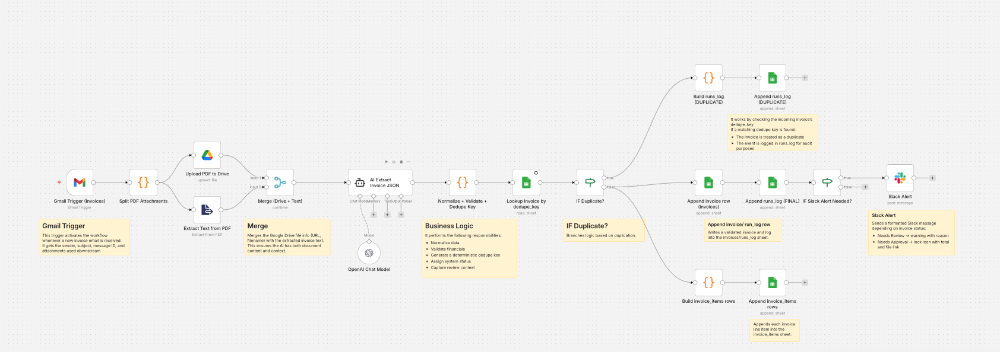

# Invoice Automation System (n8n + LLMs + Google Workspace)

An end-to-end invoice intake and processing automation that replaces manual data entry with a reliable, AI-assisted workflow.

This system ingests invoice emails, extracts structured data from PDF invoices using an LLM, validates and deduplicates records, routes high-value invoices for approval, stores clean data in Google Sheets, and logs every run

## Overview
This project implements a production-style invoice pipeline using:
- n8n for orchestration
- OpenAI (LLM) for document understanding
- Gmail for invoice ingestion
- Google Drive for file storage
- Google Sheets as a lightweight operational database
- Slack for alerts and approvals

The workflow is designed to be idempotent, auditable, and human-in-the-loop.

## Before and After

### Before: Manual Invoice Processing
- Time-consuming manual downloads and data entry
- Error-prone spreadsheets with inconsistent formatting
- No duplicate protection
- Ad-hoc approval tracking
- Limited visibility into invoice history
- Manual weekly reporting

### After: Automated Invoice Processing

- Invoices processed automatically within minutes
- AI extracts vendor, dates, totals, and line items
- Deterministic duplicate detection prevents double entry
- High-value invoices flagged for approval automatically
- Centralized invoice + line-item database
- Full execution log for audit and debugging

*Example: Structured invoice data automatically extracted and stored in Google Sheets*

## Core Features

- **Invoice Ingestion** – Monitors Gmail, extracts PDF attachments, archives files in Google Drive  
- **AI Extraction** – Uses an LLM to extract structured invoice data (vendor, dates, totals, line items) as strict JSON  
- **Validation & Business Logic** – Normalizes data, computes missing totals, validates consistency, assigns status (`logged`, `needs_review`, `needs_approval`)  
- **Duplicate Detection** – Prevents duplicate invoices using a deterministic dedupe key  
- **Data Storage** – Stores invoices, line items, and execution logs in structured Google Sheets  
- **Slack Alerts** – Notifies when invoices require review or approval with links to source files  

## How It Works

### Step-by-Step Workflow

How the Workflow Works
1. Invoice Ingestion
  - Gmail trigger detects a new invoice email
  - PDF attachments are extracted and archived in Google Drive

2. AI Extraction
  - PDF text is analyzed by the LLM
  - Structured invoice JSON is returned

3. Normalization & Validation
  - Data is cleaned and validated
  - Totals are checked for consistency
  - System status is assigned

4. Duplicate Check
  - Existing invoices are checked using the dedupe key
  - Duplicates are logged and skipped

5. Storage
  - Invoice metadata is written to the invoices sheet
  - Each line item is written to invoice_items
  - Execution details are recorded in runs_log

6. Alerts
  - Slack alerts are sent for needs_review or needs_approval invoices

### Future Enhancements

- Slack approve / reject buttons
- Approval timestamps and user tracking
- Accounting system integrations (QuickBooks, NetSuite)
- Dashboard reporting
- Vendor-level spend analytics